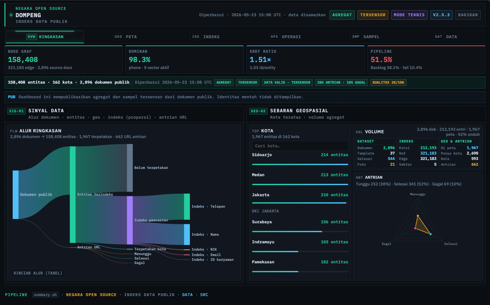
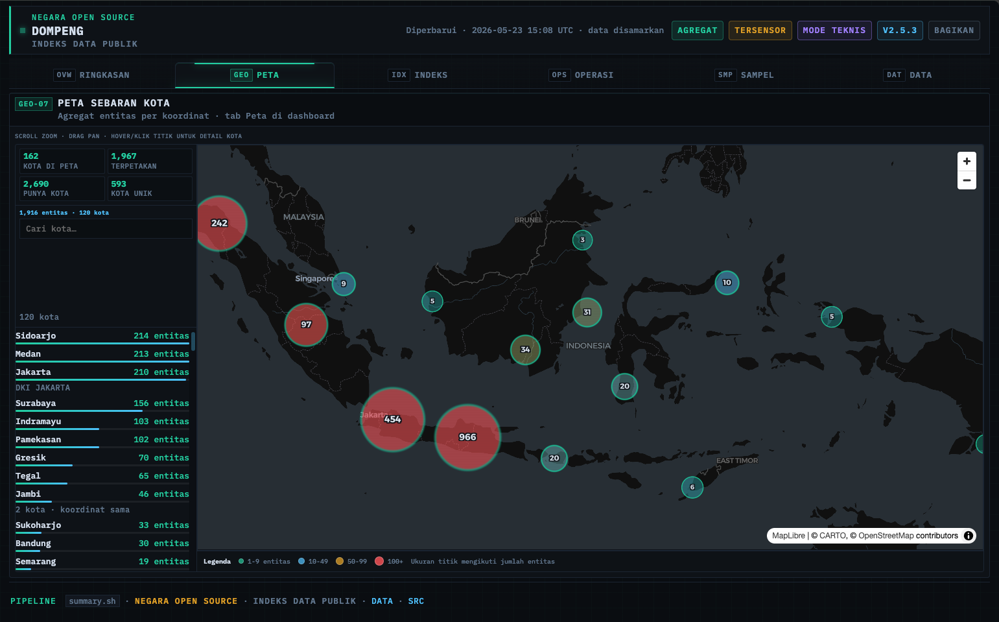
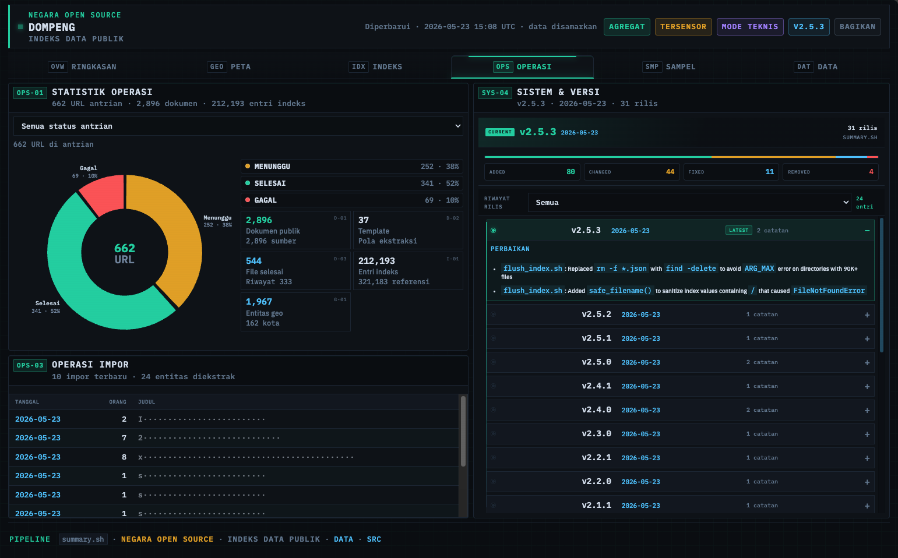
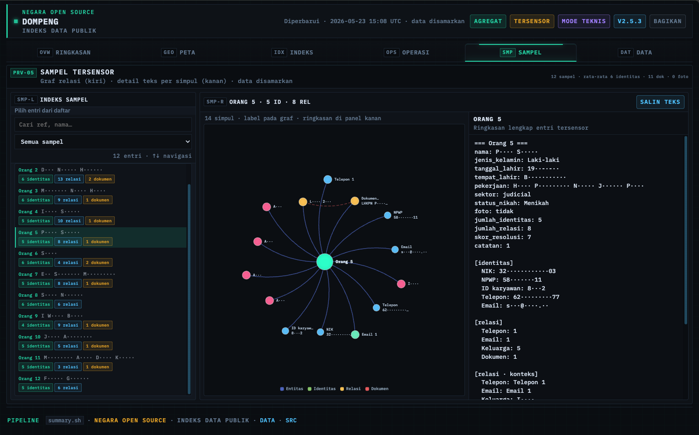
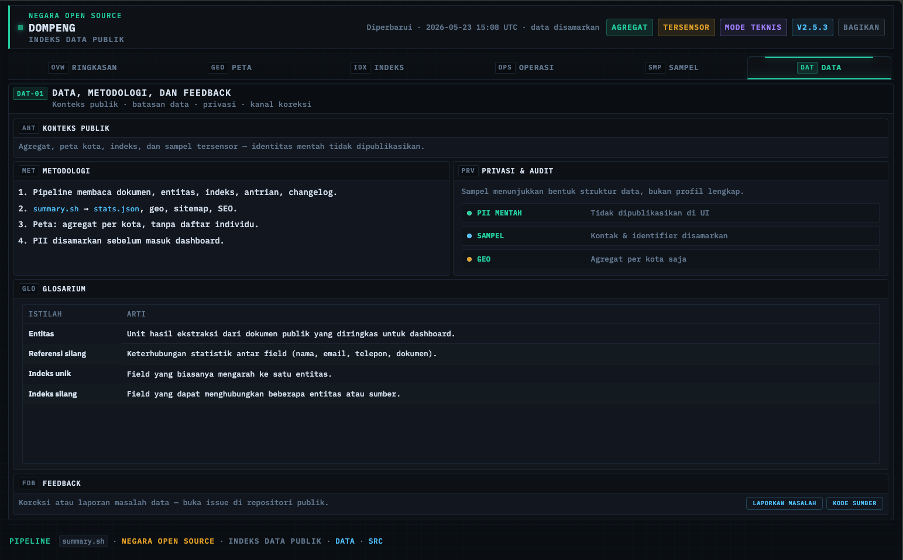

# DOMPENG — Dashboard Ringkasan

**Preview:** [https://dompeng.iamutaki.workers.dev/](https://dompeng.iamutaki.workers.dev/)

Ini adalah **situs web dashboard** untuk melihat **ringkasan hasil pencarian informasi publik (OSINT) dari Mesin Pencari seperto Google/Bing/etc.** yang telah dikumpulkan dan diolah oleh proyek DOMPENG.

Bukan halaman untuk mengedit data, melainkan **papan ringkasan** agar siapa saja bisa melihat gambaran besar: berapa banyak data yang terkumpul, di mana sebarannya, dan bagaimana kondisi pengumpulan — **tanpa menampilkan data pribadi mentah**.

---

## Apa itu dashboard ini?

Proyek DOMPENG melakukan pencarian dan pengumpulan informasi dari sumber publik di internet (terutama lewat Google). Hasilnya banyak: profil orang, dokumen, foto, dan tautan terkait.

Dashboard ini **merangkum semuanya dalam bentuk angka, grafik, dan peta** supaya mudah dipahami sekilas — seperti laporan statistik visual, bukan daftar data mentah.

---

## Apa yang bisa Anda lihat di situs?

| Bagian | Penjelasan singkat |
|--------|-------------------|
| **Peta** | Titik per kota: banyaknya entitas (orang/entitas) yang tercatat di wilayah itu — hanya jumlah, bukan nama individu |
| **Ringkasan angka** | Kartu hitungan cepat: jumlah orang, dokumen, foto, template, dan sejenisnya |
| **Alur data** | Diagram alur: dari dokumen ke entitas, lalu ke lokasi dan indeks pencarian |
| **Sebaran wilayah** | Kota dengan entitas terbanyak, plus status antrian unduhan (menunggu, selesai, gagal, sedang diproses) |
| **Indeks pencarian** | Gambaran jenis data apa saja yang paling banyak terindeks |
| **Contoh tersensor** | Cuplikan struktur relasi data — nama, NIK, telepon, email, dll. **disamarkan** agar tidak membocorkan identitas asli |
| **Dokumen terbaru** | Daftar impor dokumen terakhir (judul/judul publik sudah disensor) |
| **Catatan pembaruan** | Riwayat perubahan versi proyek |

---

## Pratinjau antarmuka

Cuplikan layar berikut menunjukkan tab-tab utama dashboard. Buka [preview live](https://dompeng.iamutaki.workers.dev/) untuk versi interaktif.

### Ringkasan (OVW)

Kartu indikator, diagram alur data (Sankey), daftar kota teratas, dan volume inventaris — gambaran besar dalam satu layar.



### Peta (GEO)

Peta interaktif: titik per kota menunjukkan jumlah entitas tercatat di wilayah itu (agregat, tanpa nama individu).



### Operasi (OPS)

Status antrian unduhan, progres pengumpulan, dan metrik operasional pipeline data.



### Sampel (SMP)

Cuplikan struktur relasi data dengan **nama, NIK, telepon, email, dan sejenisnya disamarkan** — hanya untuk memahami bentuk data, bukan identitas asli.



### Data (DAT)

Daftar impor dokumen terbaru dan catatan pembaruan versi proyek.



---

## Privasi & keamanan data

- Yang ditampilkan di situs **bukan data asli lengkap**, melainkan **angka agregat** (total, rata-rata, per kota) atau **cuplikan yang sudah disamarkan**.
- Data sensitif seperti nama lengkap, NIK, NPWP, telepon, dan email hanya muncul dalam bentuk **samaran** — cukup untuk memahami struktur, tidak untuk mengidentifikasi orang tertentu.
- Koordinat di peta hanya menunjukkan **lokasi kota**, bukan alamat rumah seseorang.

---

### How to run

```bash
cd web
python3 -m http.server 8080
```

## Ringkasan satu kalimat

> **Dashboard publik DOMPENG:** ringkasan visual hasil pengumpulan informasi publik dari Mesin Pencari — angka, grafik, dan peta — dengan data pribadi disamarkan, diperbarui otomatis dari proyek utama.
